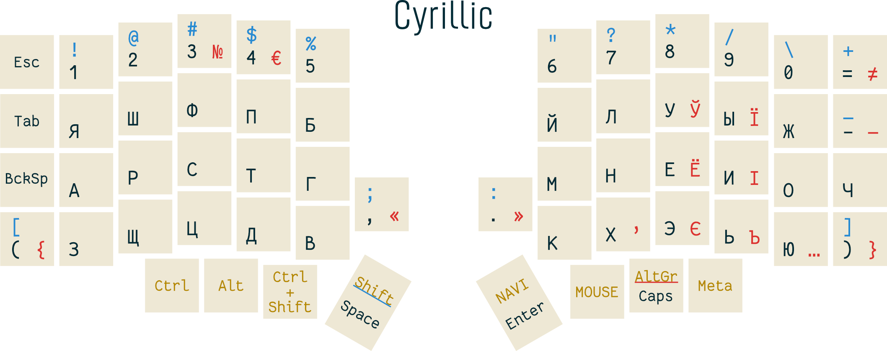

# My multilingual layout for Lily58 keyboard

* [Keyboard maintainer](https://github.com/kata0510/Lily58)
* [QMK repo tree](https://github.com/qmk/qmk_firmware/tree/master/keyboards/lily58)


## Layout rationale

* Being able to type in English, Finnish, Swedish, Russian, Ukrainian and Belarussian when having just two system layouts.
* Colemak-DH layout has been chosen for English as more finger friendly when typing.
* Phonetic layout has been chosen for Cyrilic languages to not lose ability to type in Ukrainian or Russian on built-in laptop keyboards with this layout installed.
* All printable characters are fit into main keyboard layer, UTIL and PAGE layers are used for other stuff.
* Punctuation marks used in both Latin and Cyrillic based languages are on the same keys to reduce cognitive load.
* As few more than two keys combos when typing as possible.
* No modifier keys under other fingers but thumbs.


## Cheatsheet

### Unsorted comments

* Printable characters: black are being typed just by key press, blue ones are typed with Shift held, red ones are being typed with AltGr held. For letters, lower case variants are omitted.
* Big thumb buttons: space when tapped, Shift when held; enter when tapped, UTIL layer when held.
* Caps Lock is being kept just for layour switching purposes. Paired with AltGr, short tap to toggle.
* LOCK button on UTIL and PAGE layers locks them so modifier button could be released. To return to the main one, MAIN button is used. Known bug: layout locked in such way is not being displayed properly on OLED, I'll fix it as soon as I get more familiar with QMK code.
* C-DH, QWER and GAME buttons on UTIL layer switch default typing layout to Colemak-DH, QWERTY and gaming one respectively.

### [Printable PDF](img/a4-cheatsheet.pdf)





*OLED info:*

  * Left: current layer, modifier keys statuses
  * Right: just some static images


## Artifacts

[pCloud Drive](https://e1.pcloud.link/publink/show?code=kZpXMRZjCs4DnfY9Df7yDb7JWtNVuoUbMJX). So far, contains firmware binary and Windows input language installer archives. Everything is built from up-to-date main branch.


## Keyboard firmware build

I use Ubuntu WSL running under Windows 10 for building. MSYS2 environment which is another option for QMK hasn't been tested.

[QMK installation instructions.](https://beta.docs.qmk.fm/tutorial/newbs_getting_started)

```
~ $ git clone https://github.com/qmk/qmk_firmware
~ $ git clone https://github.com/archydragon/lily-layout
~ $ cd qmk_firmware
~/qmk_firmware $ ln -s ~/lily-layout/qmk_keymap keyboards/lily58/keymaps/archydragon
~/qmk_firmware $ make lily58:archydragon
```

It should result with writing a firmware file named `lily58_rev1_archydragon.hex` under the current directory.


## Flash

[QMK Toolbox GUI](https://github.com/qmk/qmk_toolbox) is recommended for flashing. Or see ["Flashing Firmware" page](https://beta.docs.qmk.fm/tutorial/newbs_flashing) in QMK documentation.

Initially, both sides should be flashed to fully update OLED configuration and displayed data. After that, if you just need to update layout, flashing master side is enough.


## OS Layouts

So far, only Windows layouts have been built, tested and used in wild life. You may grab compiled layouts from "Artifacts" section above or built them yourself based on .klc files under this repo using [MSKLC tool](https://www.microsoft.com/en-us/download/details.aspx?id=102134) (ignore warnings about duplicate characters). After installing layours, reboot to see them in available inputs list.


## Extra credits

* [QMK Logo Editor](https://joric.github.io/qle/)
* Modifier keys status indicator stolen from [soundmonster's CRKBD config](https://github.com/qmk/qmk_firmware/blob/master/keyboards/crkbd/keymaps/soundmonster/keymap.c)
